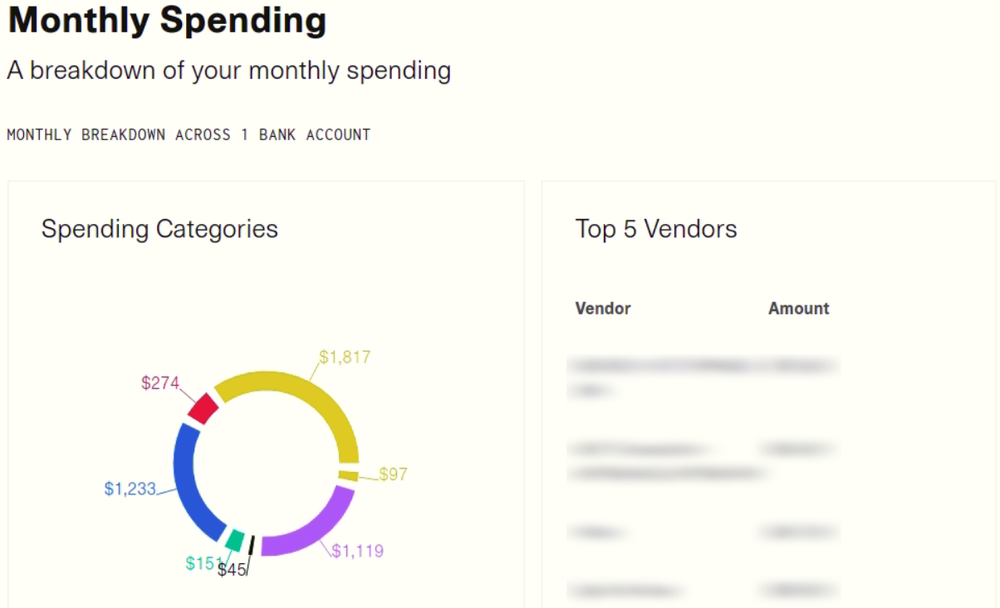
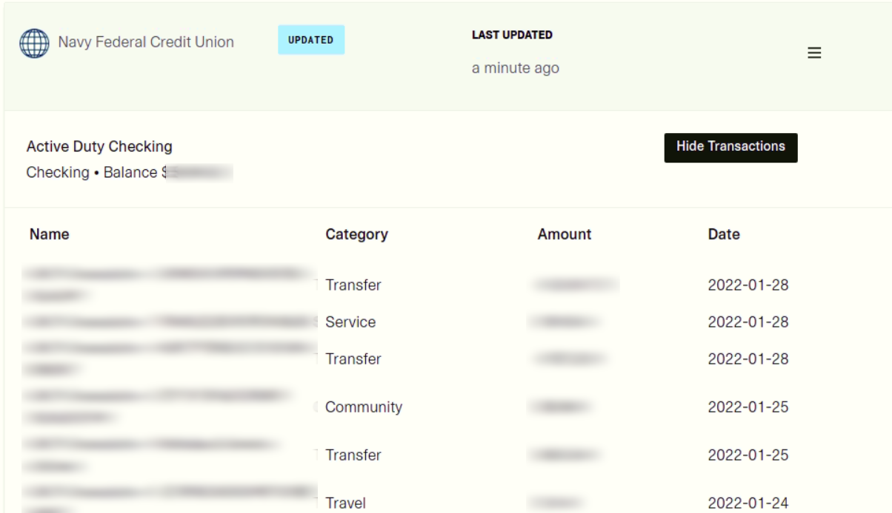

# Plaid Bank Transaction Dashboard
Plaid is an app which allows 3rd party connection to many banking institutions. The merit of this app is the functionality that makes multi-access possible.
<!--  -->


Further, the app conveniently extracts transaction histories of each account, which is the primary reason for me to study Plaid for my personal finance organization.
<!--  -->


## Environment
Current app was tested in Ubuntu 20.04. Also required is up-to-date Docker for installation.

## Installation
1. Set up dotenv file for log in credential
```
cp .env.template .env
```
2. Pull docker image (note that sudo is used in case base environment is used)
```
sudo make start
```
3. Open https://localhost:3001
4. For closing service, use the following command
```
sudo make stop
```

## Setting up dotenv file
Initially we have to create an environment file for login credential. Simple use .env.template and create .env file. The `PLAID_CLIENT_ID` and `PLAID_SECRET_KEYS` can be found on the [key](https://dashboard.plaid.com/team/keys) section of the Plaid dashboard.

`PLAID_ENV` takes either `sandbox` or `development`. In order to actually test the connection to banking institutions, the app has to be loaded as a dev mode, otherwise it will throw credential error when prompted.

`REDIRECT_URI` must be matched to the receiving end of the Plaid server. If not deploying for actual service, the local address (https://localhost:3001/oauth-link) is used here. It can be set from the [api](https://dashboard.plaid.com/team/api) section of the Plaid dashboard. Note that as opposed to Plaid tutorial, the address is secure protocol is used (i.e., https instead of http). 

## Additional Information
* More in-depth explanation can be found from the [original Plaid manual](pattern-readme.md)
* Other nfcu projects are found [here](https://github.com/morissette/nfcu) and [here](https://github.com/tjhorner/node-nfcu)